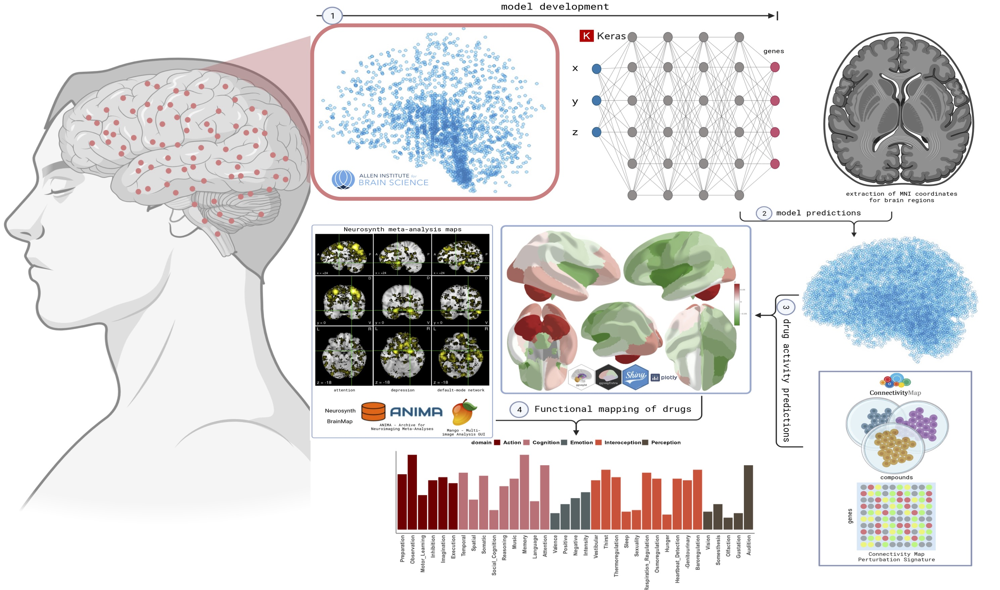

  

# Muhammad Elsadany
**Computational Biologist | Neuroscience Researcher**

[📧 Email](mailto:melsadany24@gmail.com) • 
[💼 LinkedIn](https://www.linkedin.com/in/melsadany/) • 
[💻 GitHub](https://github.com/melsadany) • 
[📄 Resume](assets/docs/profile/Elsadany-resume_111625.pdf) • 
[🔬 ORCiD](https://orcid.org/0000-0002-1019-3905)

## About Me
Brief 2-3 sentence introduction about your research interests and expertise.

## Featured Projects

### [Gene Expression Signature of Human Brain Stimulation](projects/brain-stim.md)

• Engineered an end-to-end computational pipeline for single-nuclei multi-omics (RNA+ATAC) data, implementing a bootstrapped pseudo-bulk strategy and mixed-effects models (lmmSeq) to identify cell-type- specific responses to electrical stimulation.
• Validated translational relevance through cross-species comparison (RRHO) with mouse models, identifying conserved gene sets.

**Tools:** R, Seurat, lmmSeq, RRHO2, CellChat, scSeqComm, edgeR, DCA

### [Polygenic Drug Response Signatures](projects/drug-response.md)

• Developed a computational tool integrating genetic data (GWAS, eQTL, RNA-Seq) to generate personalized treatment recommendations for psychiatric disorders, with a focus on ADHD.
• Scaled the application to cohorts with 88,000+ participants (SPARK, ABCD) and validated predictions against behavioral scales (CBCL, BPM) and neuroimaging (fMRI) data.

**Tools:** GWAS, eQTL, TWAS

### [Mapping Brain-Wide Drug Effects using Deep Learning](projects/drug-maps.md)

• Built a deep learning model that integrates brain-wide gene expression (Allen Institute) and fMRI trait maps with drug perturbation signatures (CMAP, LINCS) to predict functional brain activity changes for 838 compounds.
• Delivered insights through an interactive R Shiny application featuring 3D brain visualizations, linking compounds to phenotypic effects via Neurosynth and Neuromaps.

**Tools:** DL, eQTL, TWAS, R Shiny

### [Exceptional Ability: A Multimodal Cognitive Study](projects/te.md)

• Designed and implemented a multimodal analysis pipeline integrating NIH-Toolbox/IQ scores, a custom language task, acoustic feature extraction (audio), interview transcription (Whisper AI), facial landmarking (computer vision), and structural/functional/diffusion MRI.
• Developed a 10-minute language task that effectively captures cognitive performance, demonstrating potential as an efficient digital biomarker.

**Tools:** WhisperAI, PWEsuite, GPT, Archetypes, lingmatch, ANTs, AFNI, FSL, freesurfer, DSI-studio

[View All Projects...]
