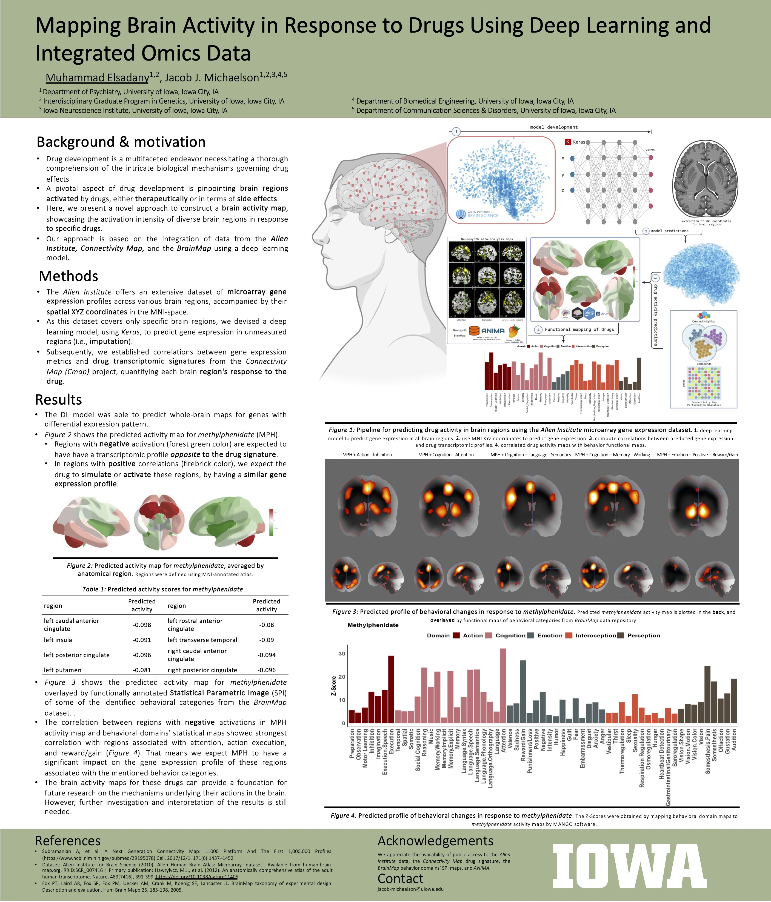

  <!-- Profile Header -->
  

    
    <h1>Muhammad Elsadany</h1>
    
<strong>Computational Biologist | Psychiatry Researcher</strong>

    

      <a href="mailto:melsadany24@gmail.com">📧 Email</a>
      <a href="https://www.linkedin.com/in/melsadany/">💼 LinkedIn</a>
      <a href="https://github.com/melsadany">💻 GitHub</a>
      <a href="assets/docs/profile/Elsadany-resume_111625.pdf">📄 Resume</a>
      <a href="https://orcid.org/0000-0002-1019-3905">🔬 ORCiD</a>
    

  

  <!-- About Me Section -->
  

    <h2>About Me</h2>
    
My passion for genetics and mental health research stems from both personal experience and a deep curiosity about human behavior. As an autistic researcher, I bring a unique perspective to understanding neurodiversity—not just as a subject of study, but as a lived reality.

    
    
My work focuses on decoding the complex relationships between genetics, cognition, and mental health through computational approaches. I integrate diverse data modalities—genetic, clinical, neuroimaging, audio, interview, and facial imagery—to uncover patterns that bridge scientific discovery with practical interventions.

    
    
A central theme of my research is leveraging language as a powerful metric for understanding cognitive functions and mental health challenges. I'm particularly interested in developing accessible tools that can capture the nuances of human experience often missed by traditional assessments.

    
    
My journey in the lab revealed how much I 'fit in' with the populations we study, leading to my own autism diagnosis at 25. This personal insight fuels my commitment to creating a more inclusive world where neurodiverse individuals are not just understood, but valued for their unique strengths.

    
    

      "I learn by going where I have to go." – Theodore Roethke
    

    
    
<em>Currently pursuing my PhD in Genetics at the University of Iowa, where I'm expanding my expertise in linguistics, computer vision, neuroimaging, and data science to better serve the neurodiversity community.</em>

  

<!-- Video Summary Section -->

  <h2>Video Summary</h2>
  
For a quick overview of my research and background, watch this video summary created by NotebookLM:

  
  

    <video 
      id="summaryVideo"
      controls
      controlsList="nodownload" 
      poster="assets/video/overview.png"
      oncontextmenu="return false;"
      style="width: 100%; border-radius: 10px; box-shadow: 0 10px 30px rgba(0,0,0,0.2);"
    >
      <source src="assets/video/vid-2.mp4" type="video/mp4">
      Your browser doesn't support the video tag. Please <a href="assets/video/vid-1.mp4">download the video</a> instead.
    </video>
    
    

      <small>🔒 Video streaming only - download disabled for privacy</small>
    

  

  <!-- Talks Section -->
  

    <h2>Selected Talks & Presentations</h2>
    
    

      <h3><a href="assets/docs/talks/INSAR.ppsx">Beyond Yes/No: A Multimodal Autism Propensity Score from Genes to Brain</a></h3>
      
<strong>INSAR Conference 2025</strong> | <em>Oral Presentation</em>

      
      
Presented a novel deep learning framework that integrates multi-modal neuroimaging features—including fractional amplitude of low-frequency fluctuations (fALFF), structural morphometry, and diffusion tensor imaging (DTI) metrics—to generate a continuous autism likelihood score (0-1). This approach demonstrates the potential of combining multiple MRI modalities for improved neurophenotyping in autism spectrum disorder.

      

        <strong>Key Topics:</strong> Deep Learning, Multi-modal MRI Integration, fALFF, Structural MRI, DTI, Autism Biomarkers
      

    

    

      <h3><a href="assets/docs/talks/INC.ppsx">Optimizing Structural MRI Processing Pipelines for 7T Data</a></h3>
      
<strong>Iowa Neuroimaging Consortium, University of Iowa</strong> | <em>Invited Talk</em>

      
      
Comprehensive overview of structural MRI processing pipelines optimized for 7T scanner data, comparing various tools and approaches for cortical reconstruction, subcortical segmentation, and surface-based analysis. Provided practical guidance on pipeline selection based on specific research objectives and data characteristics.

      

        <strong>Key Topics:</strong> 7T MRI, Structural Processing Pipelines, Freesurfer, ANTs, FSL, Cortical Reconstruction, Quality Control
      

    

  

  <!-- Projects Section -->
  

    <h2>Featured Projects</h2>

    

      <h3>Gene Expression Signature of Human Brain Stimulation</h3>
      
      <ul>
        <li>Engineered an end-to-end computational pipeline for single-nuclei multi-omics (RNA+ATAC) data, implementing a bootstrapped pseudo-bulk strategy and mixed-effects models (lmmSeq) to identify cell-type-specific responses to electrical stimulation.</li>
        <li>Validated translational relevance through cross-species comparison (RRHO) with mouse models, identifying conserved gene sets.</li>
      </ul>
      

        <strong>Tools:</strong> R, Seurat, lmmSeq, RRHO2, CellChat, scSeqComm, edgeR, DCA
      

    

    

      <h3>Exceptional Ability: A Multimodal Cognitive Study</h3>
      
      <ul>
        <li>Designed and implemented a multimodal analysis pipeline integrating NIH-Toolbox/IQ scores, a custom language task, acoustic feature extraction (audio), interview transcription (Whisper AI), facial landmarking (computer vision), and structural/functional/diffusion MRI.</li>
        <li>Developed a 10-minute language task that effectively captures cognitive performance, demonstrating potential as an efficient digital biomarker.</li>
      </ul>
      

        <strong>Tools:</strong> WhisperAI, PWEsuite, GPT, Archetypes, lingmatch, ANTs, AFNI, FSL, freesurfer, DSI-studio
      

    

    

      <h3>Polygenic Drug Response Signatures</h3>
      
      <ul>
        <li>Developed a computational tool integrating genetic data (GWAS, eQTL, RNA-Seq) to generate personalized treatment recommendations for psychiatric disorders, with a focus on ADHD.</li>
        <li>Scaled the application to cohorts with 88,000+ participants (SPARK, ABCD) and validated predictions against behavioral scales (CBCL, BPM) and neuroimaging (fMRI) data.</li>
      </ul>
      

        <strong>Tools:</strong> GWAS, eQTL, TWAS
      

    

    

      <h3>Mapping Brain-Wide Drug Effects using Deep Learning</h3>
      
      <ul>
        <li>Built a deep learning model that integrates brain-wide gene expression (Allen Institute) and fMRI trait maps with drug perturbation signatures (CMAP, LINCS) to predict functional brain activity changes for 838 compounds.</li>
        <li>Delivered insights through an interactive R Shiny application featuring 3D brain visualizations, linking compounds to phenotypic effects via Neurosynth and Neuromaps.</li>
      </ul>
      

        <strong>Tools:</strong> DL, eQTL, TWAS, R Shiny
      

    

    

      <h3>Linguistic and Behavioral Patterns in Bipolar Disorder from Social Media</h3>
      
      <ul>
        <li>Analyzed 20 years of Reddit data to identify users self-identifying with bipolar disorder, extracting temporal patterns in activity, sleep cycles, emotional expression, and content preferences.</li>
        <li>Applied natural language processing to track linguistic markers of mood episodes, including sentiment analysis, topic modeling, and GPT-4 embeddings to quantify emotional volatility over time.</li>
        <li>Identified distinct behavioral signatures including disrupted sleep patterns (via posting times), content topic shifts, and cyclical emotional patterns corresponding to reported mood episodes.</li>
      </ul>
      

        <strong>Tools:</strong> Python, NLP, GPT-4 Embeddings, Time-series Analysis, Sentiment Analysis, Topic Modeling
      

    

  

<!-- Gallery Section -->

  <h2>Data Visualization Gallery</h2>
  
Explore my favorite data visualizations across all research projects. Click on any visualization to view it in full size.

  
  

    <!-- Initial images will be loaded here -->
  

  
  

    <button id="show-more-btn" class="show-more-button">Show More Visualizations</button>
    <button id="show-less-btn" class="show-more-button" style="display: none;">Show Less</button>
  

<!-- Lightbox Modal -->

  &times;
  

    <button onclick="changeImage(-1)">&#10094;</button>
    <button onclick="changeImage(1)">&#10095;</button>
  

  

<!-- Media & Links Section -->

  <h2>Media & Additional Links</h2>
  
Explore more about my background, research environment, and contributions:

  
  

    <!-- Personal Story -->
    

      

      <h3>My Personal Journey</h3>
      
Read about my path into computational psychiatry and neurodiversity research

      <a href="https://michaelson.lab.uiowa.edu/news/2025/02/ui-psychiatry-graduate-student-muhammad-elsadany-decodes-mental-health-data-and-his" class="link-button" target="_blank">Read Story</a>
    

    <!-- Lab Profile -->
    

      

      <h3>Michaelson Lab</h3>
      
Learn about the research environment and team behind my PhD work

      <a href="https://michaelson.lab.uiowa.edu/people/muhammad-elsadany" class="link-button" target="_blank">Visit Lab</a>
    

    <!-- Program Profile -->
    

      

      <h3>IGP in Genetics</h3>
      
Explore the interdisciplinary genetics program at University of Iowa

      <a href="https://genetics.grad.uiowa.edu/people/muhammad-elsadany" class="link-button" target="_blank">Program Info</a>
    

    <!-- News Articles -->
    

      

      <h3>Research Features</h3>
      
News article about our research

      <a href="https://medicineiowa.org/fall-2024/closer-exceptional-processing" class="link-button" target="_blank">View Articles</a>
    

    <!-- Conference Materials -->

  
🎤

  <h3>INSAR 2025 Talk</h3>
  
Beyond Yes/No: A Multimodal Autism Propensity Score from Genes to Brain

  <a href="https://view.officeapps.live.com/op/view.aspx?src=https://melsadany.github.io/assets/docs/talks/INSAR.ppsx" 
     class="link-button" target="_blank">View Presentation with Animations</a>
  

    <small><a href="assets/docs/talks/INSAR.ppsx" download>Download Original</a></small>
  

    

      

      <h3>INC Talk</h3>
      
Slides from my presentation at INC

      <a href="assets/docs/talks/INC.ppsx" class="link-button">Access Materials</a>
    

    

      

      <h3>Seminar Talk</h3>
      
Slides from my lst presentation at the IGPG seminar series

      <a href="assets/docs/talks/te-PS.ppsx" class="link-button">Access Materials</a>
    

    

  

