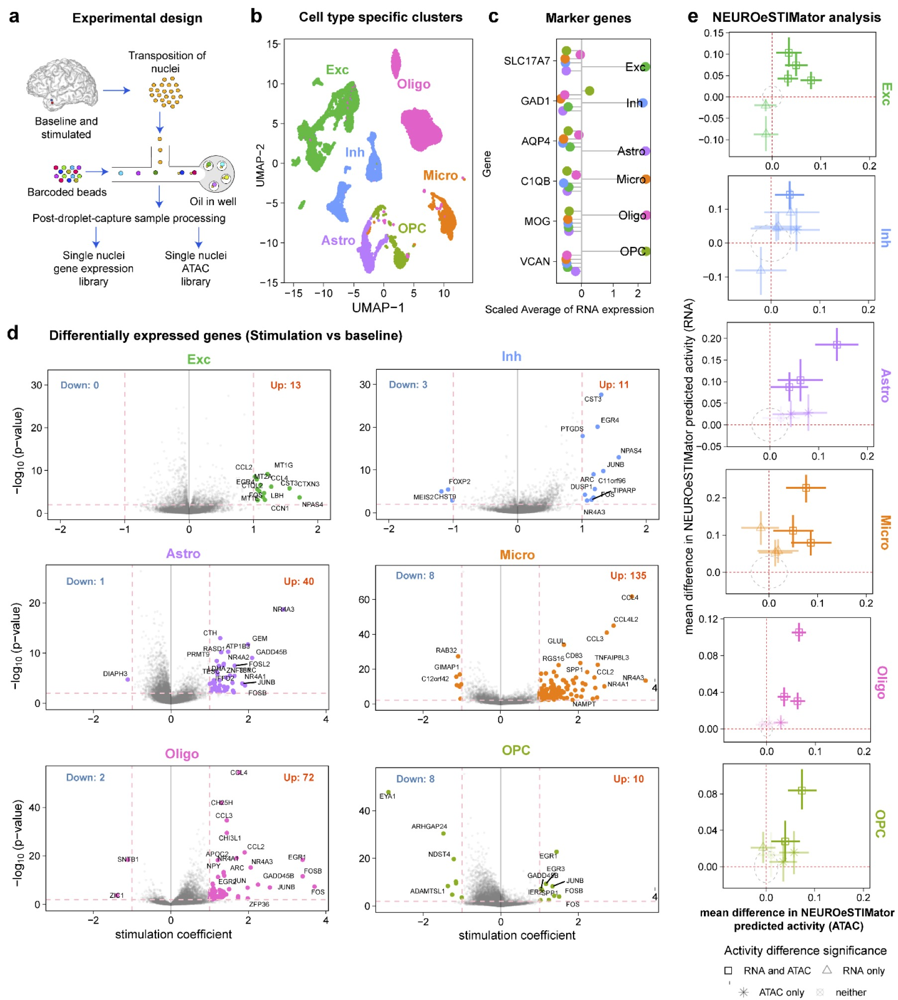
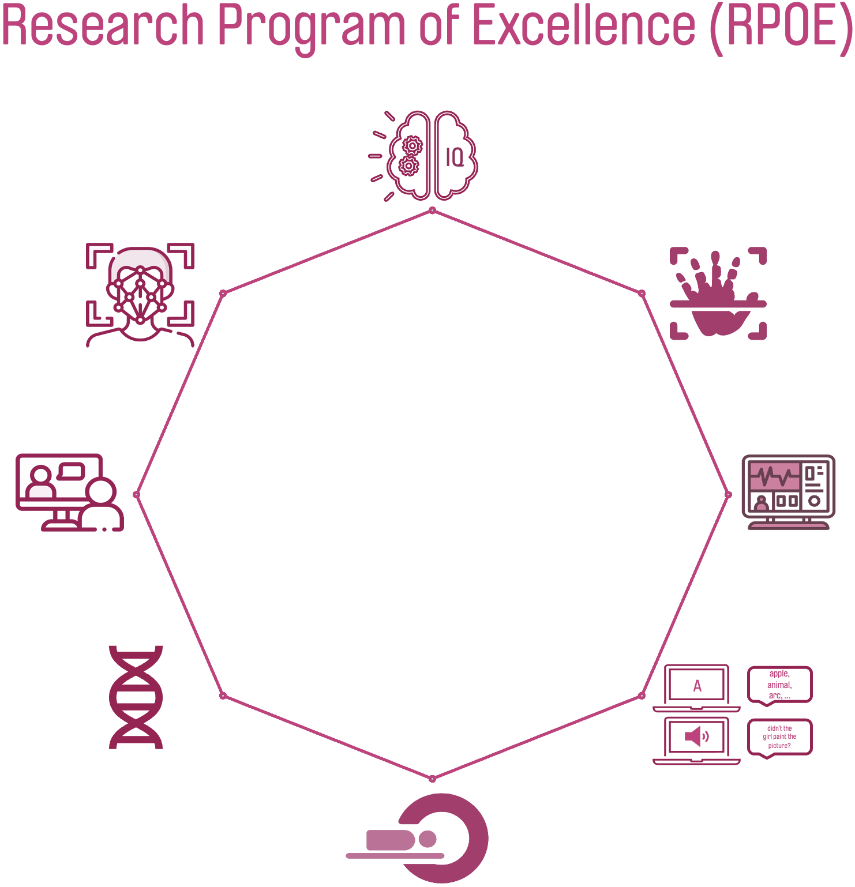
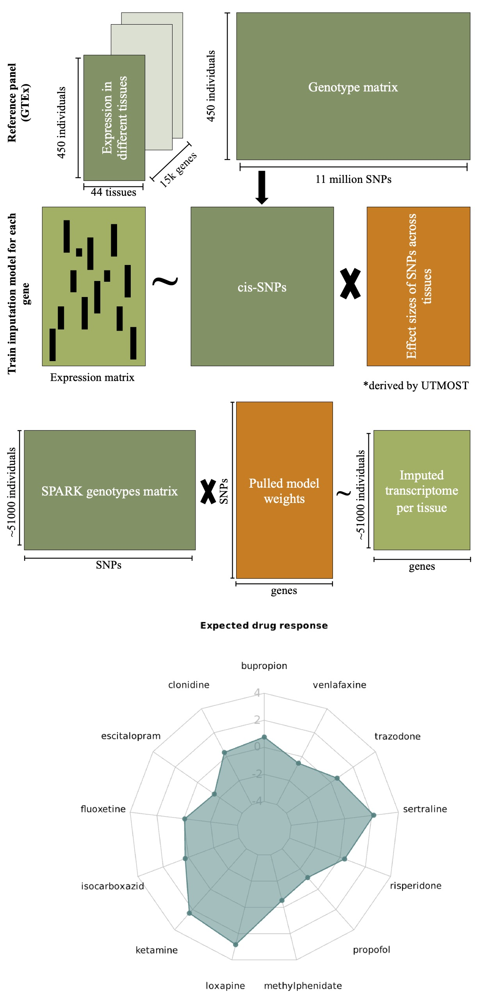
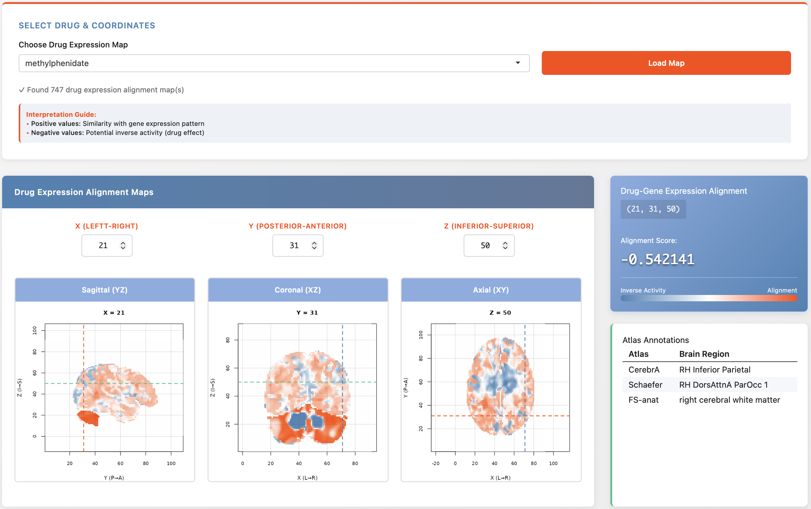
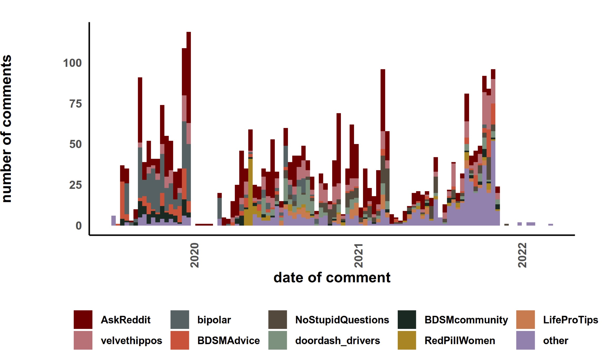
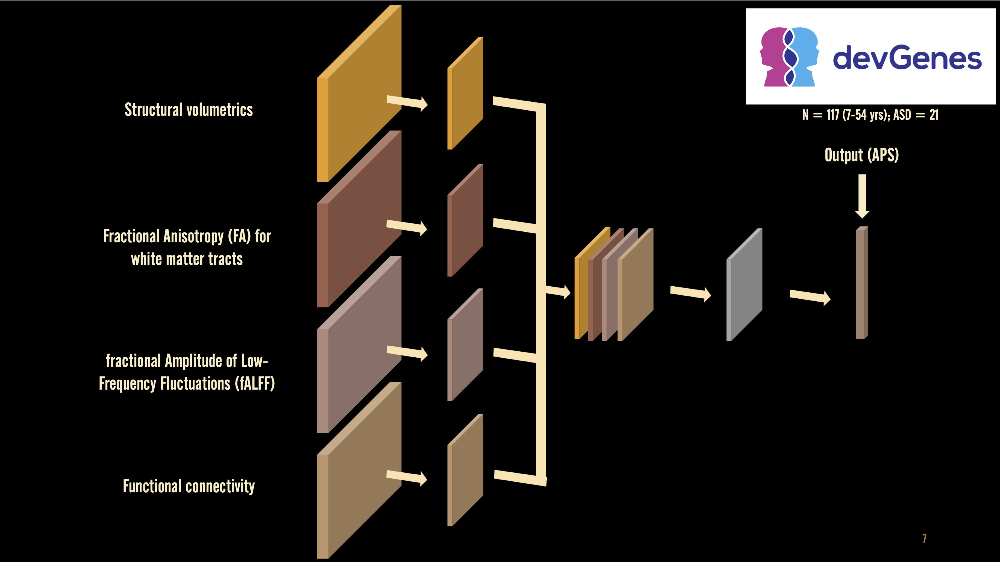
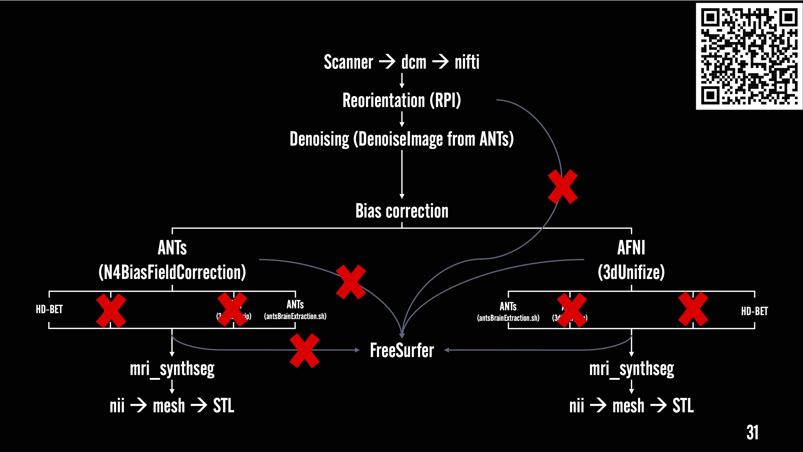

<!-- Hamburger Menu -->
<button class="hamburger-menu" id="hamburgerBtn">
  ☰
</button>

  <!-- Sidebar -->
  <aside class="sidebar" id="sidebar">
    

      
      <h1 class="profile-name">Muhammad Elsadany</h1>
      
PhD Candidate, Computational Genetics

      
University of Iowa | Psychiatry Department

    

    
    

      <a href="mailto:melsadany24@gmail.com" class="contact-link">
        melsadany24@gmail.com
      </a>
      <a href="https://www.linkedin.com/in/melsadany/" class="contact-link" target="_blank">
        LinkedIn Profile
      </a>
      <a href="https://github.com/melsadany" class="contact-link" target="_blank">
        GitHub
      </a>
      <a href="assets/docs/profile/Elsadany-resume_122825.pdf" class="contact-link">
        Resume (PDF)
      </a>
      <a href="https://orcid.org/0000-0002-1019-3905" class="contact-link" target="_blank">
        ORCiD
      </a>
    

    
    <nav class="nav-menu">
      <h3 class="nav-title">Navigation</h3>
      <ul class="nav-list">
        <li class="nav-item">
          <a href="#about" class="nav-link">
            01
            About
          </a>
        </li>
        <li class="nav-item">
          <a href="#expertise" class="nav-link">
            02
            Expertise
          </a>
        </li>
        <li class="nav-item">
          <a href="#projects" class="nav-link">
            03
            Projects
          </a>
        </li>
        <li class="nav-item">
          <a href="#talks" class="nav-link">
            04
            Talks
          </a>
        </li>
        <li class="nav-item">
          <a href="#gallery" class="nav-link">
            05
            Gallery
          </a>
        </li>
        <li class="nav-item">
          <a href="#links" class="nav-link">
            06
            Links
          </a>
        </li>
      </ul>
    </nav>
    
    

      Theme
      <label class="theme-toggle">
        <input type="checkbox" class="theme-checkbox" id="themeToggle">
        
      </label>
    

  </aside>
  
  <!-- Main Content -->
  <main class="main-content">
    

      
      <!-- Hero Statement - NEW -->
      

        <h2>Multimodal Mental Health Data Scientist</h2>
        
I build computational tools that bridge genetics, neuroimaging, and behavior to unlock insights for neurodiversity and psychiatric research. Currently finishing my PhD at University of Iowa.

      

      
      

        <a href="assets/docs/profile/Elsadany-resume_122825.pdf" class="link-button" target="_blank">
          ↓ Download Resume (PDF)
        </a>
      

      
      <!-- About Me Section - UPDATED -->
      <section id="about" class="section">
        

          
01

          <h2>About Me</h2>
        

        
        
<strong>My passion:</strong> I combine genetics, neuroimaging, and language analysis to understand mental health at the intersection of biology and behavior. As an autistic researcher, I bring lived experience to understanding neurodiversity—and I'm building tools that actually serve this community.

        
        
My research integrates diverse data modalities—genetic, clinical, neuroimaging, audio, interview transcripts, and facial imagery to uncover patterns that bridge laboratory discovery with real clinical interventions.

        
        

          <strong>What I'm looking for:</strong>
          <ul>
            <li>Clinical informatics / health data science roles in psychiatry, neurology, or genomics</li>
            <li>Computational genetics / statistical genetics positions with large-scale cohorts</li>
            <li>Data science roles in biotech, health tech, or research institutes</li>
            <li>Positions that value reproducible science and open-source tools</li>
          </ul>
        

        
        
<em>I'm wrapping up my PhD in April 2026 and actively networking. Let's chat about opportunities!</em>

      </section>
      
      <!-- Expertise Section - NEW (replaces Code & Tools + condenses Projects) -->
      <section id="expertise" class="section">
        

          
02

          <h2>Expertise & Tools</h2>
        

        
        
My work spans multimodal data analysis, reproducible pipeline development, and computational tool building for psychiatric research.

        
        

          

            <h3>Neuroimaging</h3>
            
7T structural MRI processing, fMRI analysis, DTI, cortical reconstruction, surface-based morphometry

            
freesurfer · ANTs · FSL · AFNI · nilearn

          

          

            <h3>Genomics</h3>
            
GWAS, eQTL analysis, transcriptomics, single-nuclei multi-omics, expression-QTL integration

            
R · Python · TWAS · Seurat · edgeR

          

          

            <h3>NLP & Behavior</h3>
            
Acoustic feature extraction, interview transcription, sentiment analysis, linguistic biomarkers, emotion detection

            
WhisperAI · GPT · lingmatch · topic modeling

          

          

            <h3>Reproducible Science</h3>
            
End-to-end computational pipelines, QC workflows, interactive visualizations, open-source development

            
Git · Bash · R Shiny · Docker

          

          

            <h3>Statistical Analysis</h3>
            
Mixed-effects modeling, machine learning, deep learning for phenotype prediction, cross-species validation

            
lmmSeq · scikit-learn · TensorFlow

          

          

            <h3>Computer Vision</h3>
            
Facial landmark detection, morphometric analysis, automated QC on images

            
OpenCV · facial recognition · morphometry

          

        

      </section>
      
      <!-- Projects Section - UPDATED with outcomes -->
      <section id="projects" class="section">
        

          
03

          <h2>Featured Research Projects</h2>
        

        
        

          <h3>Gene Expression Signature of Human Brain Stimulation</h3>
          
          
<strong>Key Findings:</strong> Identified cell-type-specific genes upregulated in response to electrical stimulation.

          <ul>
            <li>Engineered end-to-end pipeline for single-nuclei multi-omics (RNA+ATAC) data with bootstrapped pseudo-bulk strategy</li>
            <li>Applied mixed-effects models for robust cell-type-specific detection</li>
            <li>Cross-species validation using RRHO identified conserved gene sets</li>
          </ul>
          

            <strong>Tools:</strong> R · Seurat · lmmSeq · RRHO2 · CellChat · edgeR · DCA
          

        

        
        

          <h3>Exceptional Ability: Multimodal Cognitive Study</h3>
          
          
<strong>Key Insight:</strong> Used a 10-minute language task that effectively captures cognitive performance as a digital biomarker, demonstrating potential for scalable assessment.

          <ul>
            <li>Integrated NIH-Toolbox scores, custom language task, acoustic features, interview transcription, facial landmarks, and multi-modal MRI</li>
            <li>Applied WhisperAI for automated transcription and GPT embeddings for linguistic analysis</li>
            <li>Built reproducible QC and visualization pipelines</li>
          </ul>
          

            <strong>Tools:</strong> WhisperAI · GPT · lingmatch · ANTs · AFNI · FSL · computer vision
          

        

        
        

          <h3>Polygenic Drug Response Signatures</h3>
          
          
<strong>Impact:</strong> Scaled analysis to 88,000+ participants (SPARK, ABCD) with validated predictions against behavioral phenotypes and neuroimaging biomarkers.

          <ul>
            <li>Integrated GWAS, eQTL, and RNA-Seq to generate personalized treatment recommendations for psychiatric disorders (ADHD focus)</li>
            <li>Cross-validated polygenic scores against CBCL, BPM behavioral scales and fMRI data</li>
          </ul>
          

            <strong>Tools:</strong> GWAS · eQTL · TWAS · R
          

        

        
        

          <h3>Brain-Wide Drug Effects: Deep Learning Prediction</h3>
          
          
<strong>Deliverable:</strong> Interactive R Shiny application mapping 838 compounds to predicted functional brain changes for phenotype discovery.

          <ul>
            <li>Integrated brain-wide gene expression (Allen Institute), fMRI trait maps, and drug perturbation signatures (CMAP, LINCS)</li>
            <li>Built deep learning model for cross-dataset drug effect prediction</li>
            <li>Deployed interactive 3D brain visualizations linked to Neurosynth and Neuromaps phenotypes</li>
          </ul>
          

            <strong>Tools:</strong> Deep learning · R Shiny · 3D visualization
          

        

        
        

          <h3>Linguistic & Behavioral Patterns in Bipolar Disorder (Social Media)</h3>
          
          
<strong>Discovery:</strong> Identified distinct behavioral signatures including disrupted sleep patterns, content topic shifts, and cyclical emotional patterns aligned with mood episodes.

          <ul>
            <li>Analyzed 20 years of Reddit data identifying 2,847 self-disclosed bipolar users</li>
            <li>Extracted temporal posting patterns, sentiment, topic shifts, and GPT-4 embeddings for emotional volatility tracking</li>
            <li>Validated linguistic markers against reported mood episode timelines</li>
          </ul>
          

            <strong>Tools:</strong> Python · NLP · GPT-4 · time-series analysis · sentiment analysis · topic modeling
          

        

      </section>
      
      <!-- Talks Section - UPDATED with inline slide links -->
      <section id="talks" class="section">
        

          
04

          <h2>Selected Talks & Presentations</h2>
        

        
        

          <h3>Beyond Yes/No: Multimodal Autism Propensity Score from Genes to Brain
            <a href="assets/docs/talks/INSAR.ppsx">[View Slides →]</a>
          </h3>
          
<strong>INSAR Conference 2025</strong> | Oral Presentation

          
          
Presented novel deep learning framework integrating multi-modal neuroimaging (fALFF, structural morphometry, DTI) to generate continuous autism likelihood scores. Demonstrates potential of combining MRI modalities for improved autism neurophenotyping.

          

            <strong>Topics:</strong> Deep Learning · Multi-modal MRI · fALFF · Structural MRI · DTI · Autism Biomarkers
          

        

        
        

          <h3>Optimizing Structural MRI Processing Pipelines for 7T Data
            <a href="assets/docs/talks/INC.ppsx">[View Slides →]</a>
          </h3>
          
<strong>Iowa Neuroimaging Consortium, University of Iowa</strong> | Invited Talk

          
          
Comprehensive overview of 7T structural MRI processing pipelines, comparing tools for cortical reconstruction, subcortical segmentation, and surface-based analysis. Provided practical guidance on pipeline selection based on research objectives.

          

            <strong>Topics:</strong> 7T MRI · Processing Pipelines · freesurfer · ANTs · FSL · Quality Control
          

        

      </section>
      
      <!-- Gallery Section - UPDATED with captions -->
      <section id="gallery" class="section">
        

          
05

          <h2>Visualization Gallery</h2>
        

        
        
Click any visualization to view in full size. Gallery organized by research domain.

        
        

          <!-- Gallery populated by JavaScript -->
        

        
        
Loading...

        
        

          <button id="show-more-btn" class="gallery-btn">Show More</button>
          <button id="show-less-btn" class="gallery-btn" style="display: none;">Show Less</button>
        

      </section>
      
      <!-- Media & Links Section - UPDATED and condensed -->
      <section id="links" class="section">
        

          
06

          <h2>Media, Publications & Links</h2>
        

        
        
Learn more about my research, background, and lab environment:

        
        

          

            <h3>Personal Journey</h3>
            
My path into computational psychiatry and neurodiversity research

            <a href="https://michaelson.lab.uiowa.edu/news/2025/02/ui-psychiatry-graduate-student-muhammad-elsadany-decodes-mental-health-data-and-his" class="link-button" target="_blank">Read Story</a>
          

          

            <h3>Michaelson Lab</h3>
            
Research environment and team behind my PhD work

            <a href="https://michaelson.lab.uiowa.edu/people" class="link-button" target="_blank">Visit Lab</a>
          

          

            <h3>IGP in Genetics</h3>
            
Interdisciplinary genetics program at University of Iowa

            <a href="https://genetics.grad.uiowa.edu" class="link-button" target="_blank">Program Info</a>
          

          

            <h3>Research Features</h3>
            
News coverage of recent research

            <a href="https://medicineiowa.org/fall-2024/closer-exceptional-processing" class="link-button" target="_blank">View Articles</a>
          

          

            <h3>GitHub Repos</h3>
            
Open-source pipelines and analysis code

            <a href="https://github.com/melsadany" class="link-button" target="_blank">View Code</a>
          

          

            <h3>Connect on LinkedIn</h3>
            
Professional updates and networking

            <a href="https://www.linkedin.com/in/melsadany/" class="link-button" target="_blank">Connect</a>
          

        

      </section>
      
    

  </main>

<!-- Lightbox -->

  &times;
  

    <button onclick="changeImage(-1)">&#10094;</button>
    <button onclick="changeImage(1)">&#10095;</button>
  

  

<!-- Footer - NEW -->
<footer>
  
&copy; 2026 Muhammad Elsadany. Last updated: January 2026.

</footer>

<script>
// Theme Toggle
const themeToggle = document.getElementById('themeToggle');
const prefersDarkScheme = window.matchMedia('(prefers-color-scheme: dark)');

let currentTheme = localStorage.getItem('theme') || (prefersDarkScheme.matches ? 'dark' : 'light');
document.documentElement.setAttribute('data-theme', currentTheme);
themeToggle.checked = currentTheme === 'dark';

themeToggle.addEventListener('change', function() {
  const newTheme = this.checked ? 'dark' : 'light';
  document.documentElement.setAttribute('data-theme', newTheme);
  localStorage.setItem('theme', newTheme);
});

// Navigation active link highlight
document.querySelectorAll('.nav-link').forEach(link => {
  link.addEventListener('click', function() {
    document.querySelectorAll('.nav-link').forEach(l => l.classList.remove('active'));
    this.classList.add('active');
    
    // Close sidebar on mobile when clicking a link
    if (window.innerWidth <= 992) {
      document.getElementById('sidebar').classList.add('hidden');
      document.getElementById('mobileOverlay').classList.remove('active');
    }
  });
});

// Hamburger menu toggle
const hamburgerBtn = document.getElementById('hamburgerBtn');
const sidebar = document.getElementById('sidebar');
const mobileOverlay = document.getElementById('mobileOverlay');

if (hamburgerBtn) {
  hamburgerBtn.addEventListener('click', function(e) {
    e.stopPropagation();
    sidebar.classList.toggle('hidden');
    mobileOverlay.classList.toggle('active');
  });
  
  mobileOverlay.addEventListener('click', function() {
    sidebar.classList.add('hidden');
    mobileOverlay.classList.remove('active');
  });
}

// Gallery functionality (keeping your existing gallery code)
// Gallery images array
const galleryImages = [
{ src: 'assets/gallery/arch-1.png', caption: 'Architecture Diagram' },
{ src: 'assets/gallery/dwi.jpg', caption: 'DTI Visualization' },
{ src: 'assets/gallery/nct-1.png', caption: 'Network Analysis' },
{ src: 'assets/gallery/rpoe-data.png', caption: 'RPOE Data' },
{ src: 'assets/gallery/iq-2.png', caption: 'IQ Distribution' },
{ src: 'assets/gallery/wc-1.png', caption: 'Word Cloud' },
{ src: 'assets/gallery/sche-1.png', caption: 'Schema Diagram' },
{ src: 'assets/gallery/thesis-overview-1.jpg', caption: 'Thesis Overview' },
{ src: 'assets/gallery/sche-2.png', caption: 'Processing Schema' },
{ src: 'assets/gallery/line-2.png', caption: 'Time Series' },
{ src: 'assets/gallery/resid-1.png', caption: 'Residual Analysis' },
{ src: 'assets/gallery/rad-1.svg', caption: 'Radial Plot' },
{ src: 'assets/gallery/ne-1.jpg', caption: 'Network Connectivity' },
{ src: 'assets/images/drug-maps/overview.jpg', caption: 'Drug Response Map' },
{ src: 'assets/images/te/overview-lang.jpg', caption: 'Language Analysis' },
{ src: 'assets/gallery/bar-1.png', caption: 'Bar Chart' },
{ src: 'assets/gallery/bm-v1.jpg', caption: 'Brain Map' },
{ src: 'assets/gallery/cyto-1.jpg', caption: 'Cell Type Analysis' },
{ src: 'assets/gallery/den-1.png', caption: 'Density Plot' },
{ src: 'assets/gallery/den-2.png', caption: 'Density Distribution' },
{ src: 'assets/gallery/den-3.jpg', caption: 'Density Heatmap' },
{ src: 'assets/gallery/euc-1.jpg', caption: 'Euclidean Distance' },
{ src: 'assets/gallery/fALFF-1.png', caption: 'fALFF Map' },
{ src: 'assets/gallery/forest-1.png', caption: 'Forest Plot' },
{ src: 'assets/gallery/dti-res-1.png', caption: 'DTI Results' },
{ src: 'assets/gallery/jeo-1.png', caption: 'Jeopardy Plot' },
{ src: 'assets/gallery/loli-1.png', caption: 'Lollipop Chart' },
{ src: 'assets/gallery/mo-1.png', caption: 'Morphometry' },
{ src: 'assets/gallery/mph-1.svg', caption: 'Morphological Analysis' },
{ src: 'assets/gallery/net-1.png', caption: 'Network 1' },
{ src: 'assets/gallery/net-2.png', caption: 'Network 2' },
{ src: 'assets/gallery/peaks-1.jpg', caption: 'Peak Detection' },
{ src: 'assets/gallery/scat-1.png', caption: 'Scatter Plot 1' },
{ src: 'assets/gallery/scat-2.png', caption: 'Scatter Plot 2' },
{ src: 'assets/gallery/scat-3.png', caption: 'Scatter Plot 3' },
{ src: 'assets/gallery/sel-1.jpg', caption: 'Selection Analysis' },
{ src: 'assets/gallery/sem-1.png', caption: 'SEM Path Diagram' },
{ src: 'assets/gallery/sem-2.jpg', caption: 'SEM Results' },
{ src: 'assets/gallery/st.png', caption: 'Statistical Summary' },
{ src: 'assets/gallery/time-1.gif', caption: 'Time Series Animation' },
{ src: 'assets/gallery/time-2.png', caption: 'Temporal Pattern' },
{ src: 'assets/gallery/umap-1.jpg', caption: 'UMAP Embedding' },
{ src: 'assets/gallery/upset-1.png', caption: 'UpSet Plot' },
{ src: 'assets/gallery/viol-1.png', caption: 'Violin Plot' }
];

let currentGalleryIndex = 0;
const itemsPerPage = 12;
let maxItemsShown = itemsPerPage;

// Populate gallery on page load
function populateGallery() {
const container = document.getElementById('gallery-container');
const itemsToShow = galleryImages.slice(0, maxItemsShown);

container.innerHTML = itemsToShow.map((img, index) => 
  
${img.caption}
 
 ).join('');

updateGalleryCount();
}

function updateGalleryCount() {
const count = document.getElementById('gallery-count');
count.textContent = Showing ${Math.min(maxItemsShown, galleryImages.length)} of ${galleryImages.length} visualizations;
}

// Lightbox functions
function openLightbox(index) {
currentGalleryIndex = index;
const lightbox = document.getElementById('lightbox');
const img = document.getElementById('lightbox-img');
const caption = document.getElementById('lightbox-caption');

img.src = galleryImages[index].src;
if (!caption) {
const captionDiv = document.createElement('div');
captionDiv.id = 'lightbox-caption';
captionDiv.style.cssText = 'color: white; text-align: center; margin-top: 10px; font-size: 0.9em;';
lightbox.appendChild(captionDiv);
}
document.getElementById('lightbox-caption').textContent = galleryImages[index].caption;

lightbox.style.display = 'block';
}

function closeLightbox() {
document.getElementById('lightbox').style.display = 'none';
}

function changeImage(direction) {
currentGalleryIndex = (currentGalleryIndex + direction + galleryImages.length) % galleryImages.length;
openLightbox(currentGalleryIndex);
}

// Show/Hide more images
document.addEventListener('DOMContentLoaded', function() {
const showMoreBtn = document.getElementById('show-more-btn');
const showLessBtn = document.getElementById('show-less-btn');

if (showMoreBtn) {
showMoreBtn.addEventListener('click', function() {
maxItemsShown += itemsPerPage;
if (maxItemsShown >= galleryImages.length) {
maxItemsShown = galleryImages.length;
showMoreBtn.style.display = 'none';
}
showLessBtn.style.display = 'inline-block';
populateGallery();
});
}

if (showLessBtn) {
showLessBtn.addEventListener('click', function() {
maxItemsShown = itemsPerPage;
showMoreBtn.style.display = 'inline-block';
showLessBtn.style.display = 'none';
populateGallery();
// Scroll to gallery section
document.getElementById('gallery').scrollIntoView({ behavior: 'smooth' });
});
}

// Populate gallery on load
populateGallery();
});

// Close lightbox when clicking outside the image
document.addEventListener('click', function(event) {
const lightbox = document.getElementById('lightbox');
if (event.target === lightbox) {
closeLightbox();
}
});

// Keyboard navigation for lightbox
document.addEventListener('keydown', function(event) {
const lightbox = document.getElementById('lightbox');
if (lightbox.style.display === 'block') {
if (event.key === 'ArrowLeft') changeImage(-1);
if (event.key === 'ArrowRight') changeImage(1);
if (event.key === 'Escape') closeLightbox();
}
});
